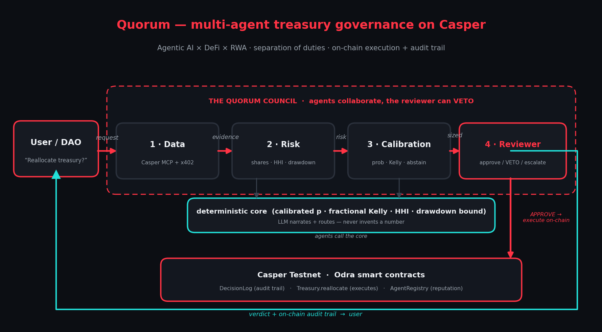

# Quorum — a calibrated multi-agent treasury council on Casper

**Casper Agentic Buildathon 2026 · Casper Innovation Track (Agentic AI × DeFi × RWA)**

Quorum is a treasury-management dApp where four specialized AI agents deliberate
off-chain over a proposed reallocation — and the chain holds them accountable.
Every deliberation is hashed and recorded in an on-chain `DecisionLog`, and the
`Treasury` contract will only move funds for a decision the log shows as
approved. The system is built to be **honest by construction**:

- **No hallucinated numbers.** Every risk figure comes from a deterministic,
  unit-tested math module. The LLM (optional) only parses intent and narrates
  the outcome — it is structurally incapable of injecting a number into the
  decision path.
- **Calibrated humility.** The council ABSTAINS when evidence is thin or
  conflicting, and ESCALATES to humans when a hard risk gate is breached.
  Refusing to act is a first-class, on-chain-recorded outcome.
- **Separation of duties, enforced twice.** The Reviewer agent can veto
  everything off-chain; on-chain, `Treasury.reallocate` independently checks
  the `DecisionLog` before any state changes.

## Architecture



### The four agents

| Agent | Duty | Forbidden from |
|---|---|---|
| **Oracle** | Gather market/yield/RWA evidence via Casper MCP reads and x402-paid data requests; hash every payload into an evidence packet | Judging or scoring data |
| **Risk** | Run the deterministic risk engine: covariance portfolio vol, marginal-contribution risk shares, HHI concentration, parametric drawdown bound, turnover | Fetching data; using an LLM |
| **Calibration** | Shrinkage-calibrated probability, evidence confidence, fractional-Kelly risk budget; **ABSTAIN** below the confidence floor or on conflicting signals | Overriding the risk engine |
| **Reviewer** | Independent policy gate over hard limits (drawdown bound, HHI, single-sleeve cap, turnover); can veto anything upstream | Being overridden — its verdict is what goes on-chain |

### Smart contracts (Odra 2.8 / Rust, Casper 2.0)

- [`DecisionLog`](contracts/src/decision_log.rs) — append-only audit trail keyed by
  request id: verdict, evidence hash, deliberation hash, execution fraction.
  Emits `DecisionRecorded` / `DecisionExecuted` (CES events). Council-only writes;
  only the wired Treasury can mark execution.
- [`Treasury`](contracts/src/treasury.rs) — holds testnet CSPR (payable `deposit`)
  and the sleeve allocation book. `reallocate(request_id, sleeves, weights_bps)`
  **only executes when `DecisionLog.is_executable(request_id)`** — i.e. an
  unexecuted APPROVE/TRIM decision — then marks it executed (no replays).
- [`AgentRegistry`](contracts/src/agent_registry.rs) — agent identities plus an
  integer-EWMA reputation in basis points updated from realized accuracy.

## Repository layout

```
contracts/      Odra (Rust) contracts + unit tests + livenet deploy script
orchestrator/   TypeScript: risk engine, calibration, 4-agent council,
                x402 client/merchant, MCP client, casper-js-sdk chain client,
                CLI, dashboard server, fixtures, 55 unit/e2e tests
dashboard/      static dashboard (deliberation + on-chain audit trail)
docs/           DEPLOY.md (testnet walkthrough), CHECKLIST.md (deliverables)
```

## Quick start (offline, no keys needed)

```bash
cd orchestrator
npm install
npm test          # 55 tests: risk math, calibration, gate, council e2e, x402 flow
npm run demo      # all three verdicts end-to-end, paying x402 per data request
npm run dashboard # http://localhost:4400 — renders the deliberations
```

`npm run demo` runs three reviews against recorded market fixtures:

1. **APPROVE** — a diversifying rotation into tokenized treasuries passes every
   gate and executes at full size.
2. **ABSTAIN_UPHELD** — conflicting, stale signals: the council refuses to act.
3. **ESCALATE** — a momentum chase into 75% CSPR breaches the drawdown-bound and
   concentration gates; routed to humans, funds untouched.

## Live on Casper Testnet

Deployed and producing transactions on chain `casper-test`:

| Contract | Package hash |
|---|---|
| DecisionLog | `hash-e45c005c6dfeb2780a1db061197791f2853d4904caefaa596b4bb05bddc0b90c` |
| Treasury | `hash-6a60d5773f0a42875405327dbf6388d7d618ad5507726083434fd1f1eb71b485` |
| AgentRegistry | `hash-32dfbfbf6e33629d8e41bb8de5167294d3f3dca63505eee2c1ba8315c9c85af0` |

Sample proof transactions (full list in [docs/CHECKLIST.md](docs/CHECKLIST.md)):
an APPROVE deliberation recorded via
[`record_decision`](https://testnet.cspr.live/transaction/050f90abf3fc16f3302b3d41b8b1dfa96620c29e666f980e400f17d6b96f4150)
and executed via
[`Treasury.reallocate`](https://testnet.cspr.live/transaction/5bfb843fe57f7f2c73cf87d73bd07084087dad28eb6fc2da302882f650ab4787);
an [ABSTAIN](https://testnet.cspr.live/transaction/dd42ab51f87569b07129bafd472df9be2e5d3d1c35437a9bdd5e22a540db625f)
and an [ESCALATE](https://testnet.cspr.live/transaction/d523a9b0fbf77b300bf074475c830b965af534e27e4d21431e24165cf9723ee5)
recorded with zero funds moved.

## Casper Testnet (transaction-producing path)

Full walkthrough: [docs/DEPLOY.md](docs/DEPLOY.md). Summary:

```bash
# 1. keys + faucet (once)
casper-client keygen contracts/keys
# fund via https://testnet.cspr.live/tools/faucet

# 2. build the wasm and deploy the three contracts (prints package hashes)
cd contracts && cargo odra build
cd ../orchestrator
QUORUM_SECRET_KEY_PATH=../contracts/keys/secret_key.pem npm run deploy
# (Unix alternative: cargo run --bin deploy_on_livenet --features=livenet)

# 3. point the orchestrator at them
cp .env.example .env   # paste the printed hashes

# 4. run a review that writes to the chain
npm run review -- --scenario approve --x402 --chain
#   → DecisionLog.record_decision tx, then Treasury.reallocate tx
npm run review -- --scenario abstain --x402 --chain
#   → DecisionLog.record_decision tx only (nothing executable)
npm run review -- --scenario escalate --x402 --chain
#   → DecisionLog.record_decision tx only (risk gate breached)
```

Every run prints `https://testnet.cspr.live/transaction/<hash>` links and saves
a full run record under `orchestrator/runs/` for the dashboard.

## Integrations

- **Casper MCP** — `--mcp` adds a live read from the hosted testnet MCP server
  (`https://mcp.testnet.cspr.cloud/mcp`, free key from
  [console.cspr.build](https://console.cspr.build)) into the evidence packet's
  provenance.
- **x402 micropayments** — the Oracle pays per data request using the x402 v2
  wire protocol (402 challenge → signed `transfer_with_authorization` payload in
  the `PAYMENT-SIGNATURE` header → receipt). Settlement modes: `local-mock`
  (ed25519-verified, offline-reproducible — the default) or the CSPR.cloud
  facilitator (`X402_FACILITATOR_URL`/`_TOKEN`; payloads follow the facilitator's
  published shapes). Payment receipts land in the on-chain-hashed evidence packet.
- **LLM narration** — `--narrate` with `ANTHROPIC_API_KEY` turns each agent's
  structured output into a one-line plain-English note. Display only; the hashed
  payloads are the source of truth.

## Honesty notes (what is real vs mocked)

- Real: contract logic + tests, testnet deployment path, both transaction kinds,
  the full risk/calibration math, the x402 HTTP flow and signatures, MCP reads.
- Demo-scoped: market vols/correlations/signals come from recorded fixtures
  (the merchant sells them over real x402); sleeves `mUSDY`/`mLP` are mock RWA
  and DeFi positions tracked as allocation bookkeeping in the Treasury.
- x402 `local-mock` settlement verifies the payment signature but does not move
  tokens; facilitator mode is wired but needs a CSPR.cloud token + CEP-18 asset.

## License

MIT — see [LICENSE](LICENSE). Built originally and entirely for the Casper
Agentic Buildathon 2026.
